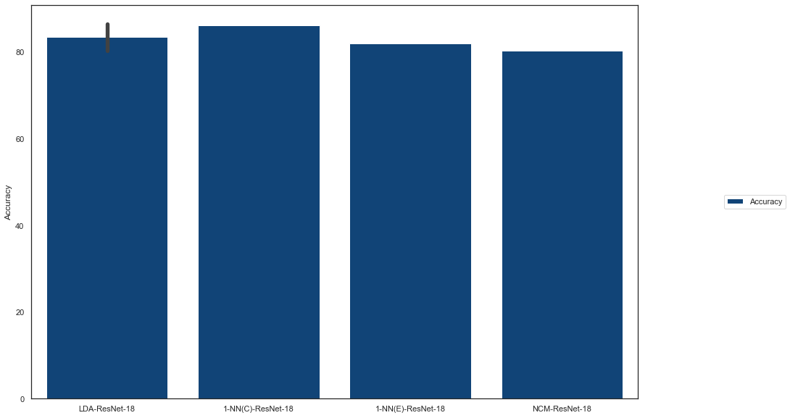

# Archive - PC
 All experiments were conducted on PC

# (Key) Requirements
python 3.8.5

scikit-learn 1.0.2

# Hardware Specification

Hardware | Specification
:----: | :----:
Processor | Intel Core i7-12700 / 12 Core
Memory | 64GB
GPU | RTX 3070 Ti 8GB

# CIFAR-10

## Method Comparison - Version 1
| Classification Method | Train Size | Test Size | Feature Extraction Method | Feature Extraction Size | Epoch | Dimension Reduction Method | Reduced Feature | Test Accuracy |
|:---------------------:|:----------:|:---------:|:-------------------------:|:-----------------------:|:-----:|:--------------------------:|:---------------:|:-------------:|
| FC                    | 50,000     | 10,000    | ResNet-18                 | 512 (16.7%)             | 100   | -                          | -               | 86.55%        |
| LDA                   | 50,000     | 10,000    | ResNet-18 (Pre, ImageNet) | 512 (16.7%)             | 100   | -                          | -               | 86.19%        |
| 1-NN(C)               | 50,000     | 10,000    | ResNet-18 (Pre, ImageNet) | 512 (16.7%)             | 100   | -                          | -               | 81.89%        |
| 1-NN(E)               | 50,000     | 10,000    | ResNet-18 (Pre, ImageNet) | 512 (16.7%)             | 100   | -                          | -               | 80.29%        |
| FC                    | 50,000     | 10,000    | ResNet-18 (Pre, ImageNet) | 512 (16.7%)             | 100   | -                          | -               | 80.27%        |
| NCM                   | 50,000     | 10,000    | ResNet-18 (Pre, ImageNet) | 512 (16.7%)             | 100   | -                          | -               | 76.98%        |
| LDA                   | 50,000     | 10,000    | ResNet-18 (Pre, ImageNet) | 512                     | 100   | PCA                        | 9 (0.29%)       | 68.69%        |
| NCM                   | 50,000     | 10,000    | ResNet-18 (Pre, ImageNet) | 512                     | 100   | PCA                        | 9 (0.29%)       | 67.27%        |
| 1-NN(C)               | 50,000     | 10,000    | ResNet-18 (Pre, ImageNet) | 512                     | 100   | PCA                        | 9 (0.29%)       | 63.89%        |
| 1-NN(E)               | 50,000     | 10,000    | ResNet-18 (Pre, ImageNet) | 512                     | 100   | PCA                        | 9 (0.29%)       | 63.18%        |
| LDA                   | 40,000     | 10,000    | -                         | -                       | 10    | PCA                        | 512 (16.7%)     | 41.08%        |
| 1-NN(C)               | 40,000     | 10,000    | -                         | -                       | 10    | PCA                        | 512 (16.7%)     | 40.00%        |
| 1-NN(C)               | 40,000     | 10,000    | -                         | -                       | 10    | PCA                        | 2,304 (75%)     | 39.56%        |
| LDA                   | 40,000     | 10,000    | -                         | -                       | 10    | PCA                        | 2,304 (75%)     | 37.51%        |
| 1-NN(C)               | 40,000     | 10,000    | -                         | -                       | 10    | -                          | 3,072 (100%)    | 36.40%        |
| LDA                   | 40,000     | 10,000    | -                         | -                       | 10    | -                          | 3,072 (100%)    | 36.08%        |
| 1-NN(E)               | 40,000     | 10,000    | -                         | -                       | 10    | PCA                        | 512 (16.7%)     | 34.68%        |
| 1-NN(E)               | 40,000     | 10,000    | -                         | -                       | 10    | PCA                        | 2,304 (75%)     | 34.22%        |
| 1-NN(E)               | 40,000     | 10,000    | -                         | -                       | 10    | -                          | 3,072 (100%)    | 34.22%        |
| NCM                   | 40,000     | 10,000    | -                         | -                       | 10    | -                          | 3,072 (100%)    | 27.14%        |
| NCM                   | 40,000     | 10,000    | -                         | -                       | 10    | PCA                        | 2,304 (75%)     | 27.14%        |
| NCM                   | 40,000     | 10,000    | -                         | -                       | 10    | PCA                        | 512 (16.7%)     | 27.14%        |
| 1-NN(M)               | 50,000     | 10,000    | ResNet-18 (Pre, ImageNet) | 512                     | 100   | PCA                        | 9 (0.29%)       | 10.26%        |

## Method Comparison - Version 2
E : Euclidean
M : Mahalanobis
C : Cosine
Pre : Pre-trained Model
FC : Fully-Connected Layer

### Top-5
[FC-ResNet-18](NCM)

[LDA-ResNet-18 (Pre, ImageNet)](LDA)

[1-NN(C)-ResNet-18 (Pre, ImageNet)](LDA)

[1-NN(E)-ResNet-18 (Pre, ImageNet)](LDA)

[FC-ResNet-18 (Pre, ImageNet)](LDA)

 

 
 
 

| Classification Method | Train Size | Test Size | Feature Extraction Method | Feature Extraction Size | Epoch | Dimension Reduction Method | Reduced Feature | Test Accuracy |
|-----------------------|------------|-----------|---------------------------|-------------------------|-------|----------------------------|-----------------|---------------|
| 1-NN(E)               | 40,000     | 10,000    | -                         | -                       | 10    | -                          | 3,072 (100%)    | 34.22%        |
| 1-NN(E)               | 40,000     | 10,000    | -                         | -                       | 10    | PCA                        | 2,304 (75%)     | 34.22%        |
| 1-NN(E)               | 40,000     | 10,000    | -                         | -                       | 10    | PCA                        | 512 (16.7%)     | 34.68%        |
| 1-NN(E)               | 40,000     | 10,000    | -                         | -                       | 10    | LDA                        | 9 (0.29%)       |               |
| 1-NN(E)               | 50,000     | 10,000    | ResNet-18 (Pre, ImageNet) | 512 (16.7%)             | 100   | -                          | -               | 80.29%        |
| 1-NN(E)               | 50,000     | 10,000    | ResNet-18 (Pre, ImageNet) | 512                     | 100   | PCA                        | 9 (0.29%)       | 63.18%        |
| 1-NN(E)               | 50,000     | 10,000    | ResNet-18 (Pre, ImageNet) | 512                     | 100   | LDA                        | 9 (0.29%)       |               |
| 1-NN(M)               | 40,000     | 10,000    | -                         | -                       | 10    | -                          | 3,072 (100%)    |               |
| 1-NN(M)               | 40,000     | 10,000    | -                         | -                       | 10    | PCA                        | 2,304 (75%)     |               |
| 1-NN(M)               | 40,000     | 10,000    | -                         | -                       | 10    | PCA                        | 512 (16.7%)     |               |
| 1-NN(M)               | 40,000     | 10,000    | -                         | -                       | 10    | LDA                        | 9 (0.29%)       |               |
| 1-NN(M)               | 50,000     | 10,000    | ResNet-18 (Pre, ImageNet) | 512 (16.7%)             | 100   | -                          | -               |               |
| 1-NN(M)               | 50,000     | 10,000    | ResNet-18 (Pre, ImageNet) | 512                     | 100   | PCA                        | 9 (0.29%)       | 10.26%        |
| 1-NN(M)               | 50,000     | 10,000    | ResNet-18 (Pre, ImageNet) | 512                     | 100   | LDA                        | 9 (0.29%)       |               |
| 1-NN(C)               | 40,000     | 10,000    | -                         | -                       | 10    | -                          | 3,072 (100%)    | 36.40%        |
| 1-NN(C)               | 40,000     | 10,000    | -                         | -                       | 10    | PCA                        | 2,304 (75%)     | 39.56%        |
| 1-NN(C)               | 40,000     | 10,000    | -                         | -                       | 10    | PCA                        | 512 (16.7%)     | 40.00%        |
| 1-NN(C)               | 40,000     | 10,000    | -                         | -                       | 10    | LDA                        | 9 (0.29%)       |               |
| 1-NN(C)               | 50,000     | 10,000    | ResNet-18 (Pre, ImageNet) | 512 (16.7%)             | 100   | -                          | -               | 81.89%        |
| 1-NN(C)               | 50,000     | 10,000    | ResNet-18 (Pre, ImageNet) | 512                     | 100   | PCA                        | 9 (0.29%)       | 63.89%        |
| 1-NN(C)               | 50,000     | 10,000    | ResNet-18 (Pre, ImageNet) | 512                     | 100   | LDA                        | 9 (0.29%)       |               |
| NCM                   | 40,000     | 10,000    | -                         | -                       | 10    | -                          | 3,072 (100%)    | 27.14%        |
| NCM                   | 40,000     | 10,000    | -                         | -                       | 10    | PCA                        | 2,304 (75%)     | 27.14%        |
| NCM                   | 40,000     | 10,000    | -                         | -                       | 10    | PCA                        | 512 (16.7%)     | 27.14%        |
| NCM                   | 40,000     | 10,000    | -                         | -                       | 10    | LDA                        | 9 (0.29%)       |               |
| NCM                   | 50,000     | 10,000    | ResNet-18 (Pre, ImageNet) | 512 (16.7%)             | 100   | -                          | -               | 76.98%        |
| NCM                   | 50,000     | 10,000    | ResNet-18 (Pre, ImageNet) | 512                     | 100   | PCA                        | 9 (0.29%)       | 67.27%        |
| NCM                   | 50,000     | 10,000    | ResNet-18 (Pre, ImageNet) | 512                     | 100   | LDA                        | 9 (0.29%)       |               |
| LDA                   | 40,000     | 10,000    | -                         | -                       | 10    | -                          | 3,072 (100%)    | 36.08%        |
| LDA                   | 40,000     | 10,000    | -                         | -                       | 10    | PCA                        | 2,304 (75%)     | 37.51%        |
| LDA                   | 40,000     | 10,000    | -                         | -                       | 10    | PCA                        | 512 (16.7%)     | 41.08%        |
| LDA                   | 40,000     | 10,000    | -                         | -                       | 10    | LDA                        | 9 (0.29%)       |               |
| LDA                   | 50,000     | 10,000    | ResNet-18 (Pre, ImageNet) | 512 (16.7%)             | 100   | -                          | -               | 86.19%        |
| LDA                   | 50,000     | 10,000    | ResNet-18 (Pre, ImageNet) | 512                     | 100   | PCA                        | 9 (0.29%)       | 68.69%        |
| LDA                   | 50,000     | 10,000    | ResNet-18 (Pre, ImageNet) | 512                     | 100   | LDA                        | 9 (0.29%)       |               |
| FC                    | 50,000     | 10,000    | ResNet-18                 | 512 (16.7%)             | 100   | -                          | -               | 86.55%        |
| FC                    | 50,000     | 10,000    | ResNet-18 (Pre, ImageNet) | 512 (16.7%)             | 100   | -                          | -               | 80.27%        |
| FC                    | 50,000     | 10,000    | ResNet-18 (Pre, ImageNet) | 512                     | 100   | PCA                        | 9 (0.29%)       |               |
| FC                    | 50,000     | 10,000    | ResNet-18 (Pre, ImageNet) | 512                     | 100   | LDA                        | 9 (0.29%)       |               |

### Time
| Method | Training Feature Extraction Time | Training Dimension Reduction Time | Model Training Time | Incremental Model Training Time | Inference Dimension Reduction Time | Inference Feature Extraction Time | Model Inference Time |
|:------:|:--------------------------------:|:---------------------------------:|:-------------------:|:-------------------------------:|:----------------------------------:|:---------------------------------:|:--------------------:|
|        |                                  |                                   |                     |                                 |                                    |                                   |                      |
|        |                                  |                                   |                     |                                 |                                    |                                   |                      |